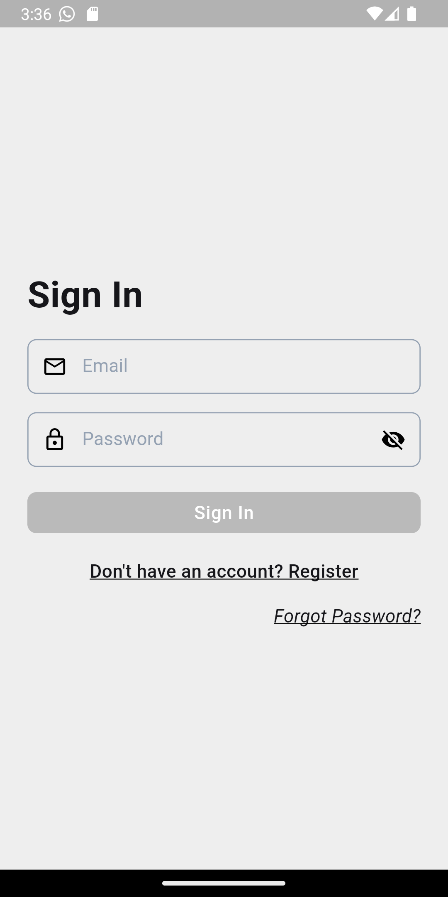
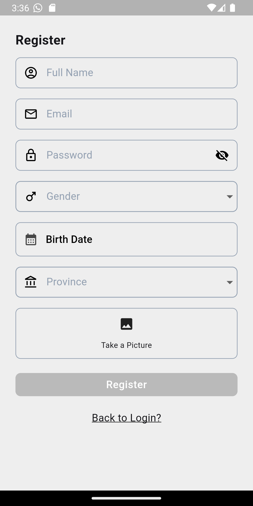
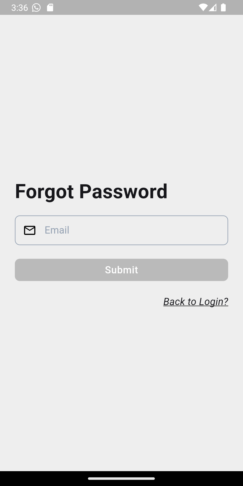
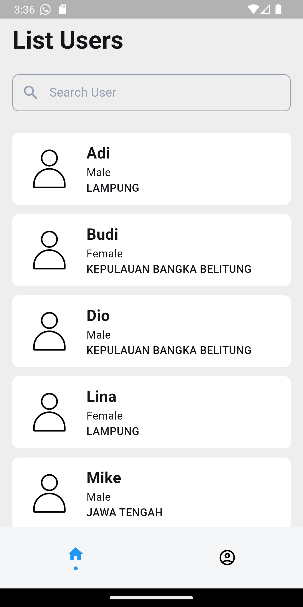
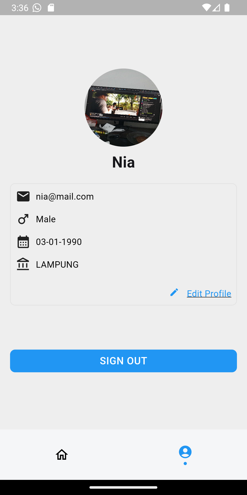
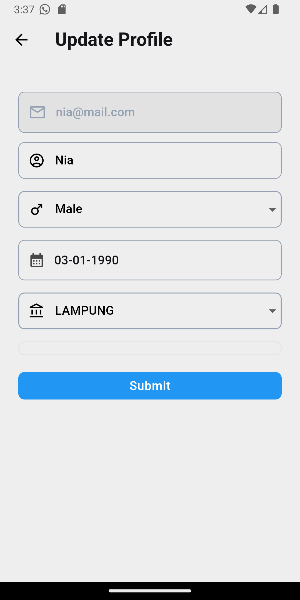

# Astronacci

## Astronacci app - technical test Astronacci International.

### Deskripsi:
Astronaccci app adalah aplikasi yang dibangun dengan flutter framework. Aplikasi ini bertujuan untuk memenuhi persyaratan technical test Mobile Appps Developer di Astronacci International. Dalam pengembangannya, aplikasi ini menerapkan konsep clean architecture dan menggunakan pendekatan struktur folder DDD (Domain-Driven Design), serta menggunakan state management  Bloc.

### Requirement:
* Flutter Version: 3.22.3

### Instalasi:
* Extract zip file ini ke dalam direktori lokal Anda.
* masuk ke folder astronacci_app
* jalankan perintah berikut di terminal untuk menjalankan aplikasi
 1. "flutter pub get"
 2. "flutter run"

### Fitur:
* Splash Screen

* Sign In

* Register

* Forgot Password

* User List

* Search User

* Edit Profile

* Error Handle
 -App Error
 -Network Error
 -Image error

### Packages & Libraries:
* connectivity: Digunakan untuk mendeteksi koneksi internet.

* flutter_bloc: Digunakan untuk state management menggunakan Bloc pattern.

* dio: Digunakan untuk melakukan HTTP requests.

* dartz: Digunakan untuk functional programming.

* cloud_firestore: Untuk database real-time.

* firebase_auth: Untuk otentikasi pengguna.

* firebase_core: Untuk inisialisasi Firebase.

* firebase_storage: Untuk penyimpanan file di cloud.

* flutter_secure_storage: Digunakan untuk menyimpan data secara aman.

* freezed: Digunakan untuk generated code dan immutable value.

* get_it: Digunakan untuk dependency injection.

* go_router: Digunakan untuk routing di aplikasi.

* hive: Digunakan untuk local data persistence.

* image_picker: Digunakan untuk mengambil foto dari Galeri dan Kamera.

* injectable: Digunakan untuk dependency injection.

* intl: Digunakan untuk internationalization dan localization.

* pull_to_refresh: Digunakan untuk pull-to-refresh functionality.

          
